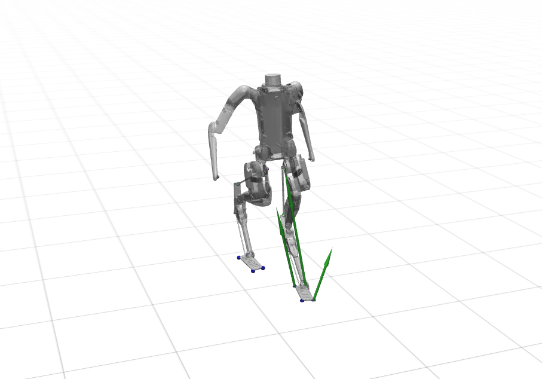

# Closed-Chain Digit Simulation and Motion Control

## Introduction

This package provides insight into various algorithms used for motion planning of humanoid robots, such as foothold placement, COM trajectory optimization, and controller design for closed-chain robots. By utilizing this package, users can gain knowledge about these complex algorithms and their implementation.  (Note: forward veolocity beyond **4.0m/s** in simulator [MuJoCo](https://mujoco.org/))

[video](https://drive.google.com/file/d/1cLD83HytvqX6r0aE3TzPF23wfX0IMfzw/view?usp=sharing
)
<div align="center">
    
</div>

## Advantage
As far as the author is aware, this package represents the first opens-source complete solution for motion planning and control of humanoid robot with closed chains. It is hoped that this package will be useful to those looking to learn about motion planning and control algorithms. Please note that some of the algorithms included in this package have not yet been published and are subject to copyright protection.
### clone this project

```
# Open a new terminal
git clone https://github.com/pianist1234567i/Digit.git
```

### Build this pakcage
```
cd Digit & mkdir build
```

```
cd build & cmake ..
```

```
make -j4
```

### Run package
```
sh ../run.sh
```

# Reference

[1] Yang, Shunpeng, et al. "Improved Task Space Locomotion Controller for a Quadruped Robot with Parallel Mechanisms." 2022 IEEE/RSJ International Conference on Intelligent Robots and Systems (IROS). IEEE, 2022.

[2] Featherstone, Roy. Rigid body dynamics algorithms. Springer, 2014.
